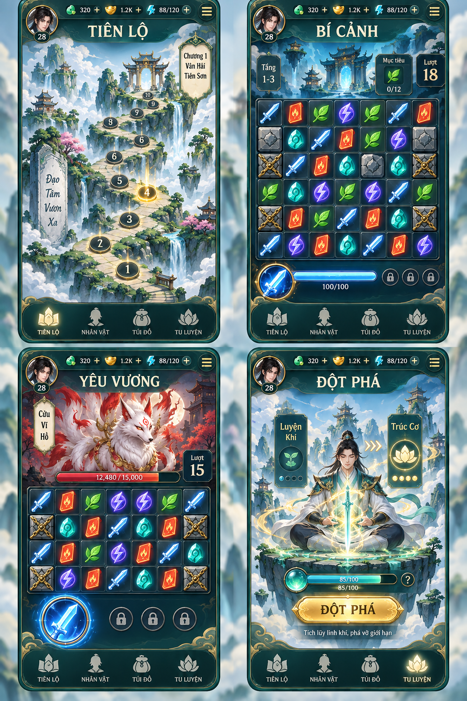

# Kiếm Khai Tiên Lộ

> **Tài liệu thiết kế đang phát triển.** Các quy tắc được phân biệt với thông số và phương án còn đề xuất; chỉ số mẫu chưa phải cam kết cân bằng cuối cùng.

Kiến trúc và hướng dẫn chạy prototype: [SYSTEM_ARCHITECTURE.md](SYSTEM_ARCHITECTURE.md) · [README.md](README.md).



> **Bản nội dung 2:** Client Expo/React Native có 40 màn, bốn loại ô, ô cường hóa, tám kiếm thuật, tám bảo kiếm, cửa hàng offline và tu vi theo EXP. Catalog và domain trong content/ dùng chung cho client/server. Chỉ số hiện là cấu hình thử nghiệm.

## 1. Tầm nhìn

**Kiếm Khai Tiên Lộ** là game giải đố ghép 3 theo màn, lấy cảm hứng từ hành trình kiếm tu. Người chơi ghép các linh vật để phá phong ấn, vượt bí cảnh, đánh yêu thú và đột phá cảnh giới. Trò chơi giữ thao tác đơn giản, nhịp nhanh của dòng casual nhưng tạo bản sắc bằng kiếm khí, pháp thuật và thế giới tu tiên mở dần qua từng chương.

| Thành phần | Định hướng |
| --- | --- |
| Thể loại | Ghép 3, giải đố qua màn, có biến tấu chiến đấu |
| Nền tảng | iOS và Android |
| Màn hình, điều khiển | Dọc; vuốt đổi chỗ hai ô cạnh nhau; chơi thuận tiện bằng một tay |
| Một lượt chơi | Khoảng 1–3 phút |
| Đối tượng | Người thích giải đố casual, hình ảnh tiên hiệp và cảm giác tiến bộ liên tục |
| Mô hình | Miễn phí; quảng cáo nhận thưởng do người chơi chủ động chọn |

### Ba trụ cột thiết kế

1. **Dễ vào, có lựa chọn thú vị:** hiểu luật ghép trong vài giây; quyết định dùng kiếm khí, tạo ô đặc biệt và xử lý chướng ngại đúng lúc.
2. **Tu tiên hiện diện trong gameplay:** mỗi mục tiêu, kỹ năng, màn boss và lần đột phá đều gắn với hành trình kiếm tu, thay vì chỉ đổi hình viên kẹo.
3. **Sức mạnh chung, phong cách riêng:** vượt màn tăng tu vi và cảnh giới theo một lộ trình chung; kiếm thuật và bảo kiếm tạo cách chơi khác nhau cho từng người chơi.

## 2. Vòng chơi chính

Chọn trang bị → chọn màn → đổi ô tạo ghép → tích kiếm khí và dùng skill → thắng màn → nhận EXP, linh thạch và mở màn tiếp.

### Bốn ô cơ bản

Mọi màn dùng Kiếm, Hỏa, Lôi, Tụ Linh Châu. Bàn 7×7 bắt đầu không có match sẵn và có nước đi. Bốn loại có trọng số sinh bằng nhau. Thảo dược, băng và các ô theo màn sẽ thiết kế sau.

| Ô | Sát thương cơ bản | Kiếm khí |
| --- | ---: | ---: |
| Kiếm | 10 | 1 |
| Hỏa | 6 | 2 |
| Lôi | 4 | 3 |
| Tụ Linh Châu | 0 | 6 |

Giá trị tính theo mỗi ô bị xóa. Tụ Linh Châu luôn gây 0 sát thương. Bảo kiếm áp dụng modifier; sát thương nhân hệ số tu vi rồi làm tròn xuống.

### Ghép và ô cường hóa

- Ghép 3 ô thường chỉ nhận chỉ số cơ bản.
- Ghép 4 giữ một ô cấp 4; ghép từ 5 giữ một ô cấp 5. Các ô còn lại bị xóa và nhận chỉ số.
- Điểm giữ ưu tiên ô đích rồi ô nguồn. Cascade dùng ô thường hợp lệ đầu tiên theo hàng/cột.
- Đường ghép giao nhau tính số ô khác nhau. Nhóm đã có ô cường hóa kích hoạt chúng, không tạo thêm ô mới.
- Ghép ít nhất ba ô cùng loại để kích hoạt trực tiếp. Đổi không tạo match không tiêu lượt.
- Hiệu ứng đánh trúng ô cường hóa kích hoạt nó. Ô vừa tạo giữ đến đợt tiếp theo.

| Ô | Cấp 4 | Cấp 5 |
| --- | --- | --- |
| Kiếm | Chém hàng ngang | Chém hình chữ thập |
| Hỏa | Nổ 3×3 | Nổ hình thoi 13 ô |
| Lôi | Ăn thêm 50% ô Lôi còn lại, làm tròn lên | Ăn toàn bộ ô Lôi còn lại |
| Tụ Linh Châu | Ô kích hoạt nhận 3 lần khí cơ bản | Ô kích hoạt nhận 5 lần khí cơ bản và Ngưng Khí |

Ngưng Khí giảm 25% chi phí skill tiếp theo, không cộng dồn, tồn tại trong màn đến khi dùng. Chỉ tiêu thụ khi cast thành công. Khí đầu màn là 0, tối đa 100, khí dư bỏ đi.

### Chuỗi hiệu ứng

Hàng đợi ổn định: chém → nổ → lan lôi → rơi ô → cascade. Animation chạy từng hiệu ứng lần lượt. Mỗi ô trao chỉ số một lần và mỗi ô cường hóa kích hoạt một lần trong một đợt. Lôi chọn ô còn lại gần nguồn nhất, phân giải theo hàng/cột.

Ô bị xóa trao chỉ số theo loại của chính nó. Phong ấn phải được gỡ trước khi ô bị xóa. Shuffle hết nước đi không mất lượt, giữ ô cường hóa. Xử lý có giới hạn để tránh treo; giảm chuyển động giữ cùng kết quả logic.

## 3. Loại màn chơi và độ khó

### Khám phá bí cảnh

Mục tiêu gồm phá phong ấn, mở đường qua đá chắn, thu thập linh thạch hoặc linh dược. Một số màn có cơ quan chỉ mở khi ghép biểu tượng tương ứng ở gần. Bối cảnh kể chuyện qua cổng bí cảnh, trận pháp và vật phẩm tìm được, với rất ít hội thoại.

### Chiến đấu yêu thú

Các ô Kiếm, Hỏa và Lôi bị xóa gây sát thương vào yêu thú; Tụ Linh Châu cung cấp kiếm khí để dùng kiếm thuật. Ghép 4–5 và kỹ năng tạo khoảnh khắc tấn công mạnh. Yêu thú có thể dựng giáp, đặt phong ấn lên vài ô hoặc thay đổi mục tiêu sau một số lượt; mỗi boss chỉ dùng một cơ chế nổi bật để người chơi đọc được tình huống. Hoàn thành khi máu boss về 0 trước khi hết lượt.

Hai loại màn được xen kẽ gần cân bằng để hành trình không thành chuỗi trận đánh liên tục. Boss đặt ở cuối mỗi chương, với cơ chế đã được giới thiệu ở các màn trước.

### Nhịp tăng độ khó — sẽ thiết kế chi tiết sau

- Các màn đầu dạy đổi ô, ghép 4–5 và dùng kiếm khí bằng tình huống dễ hiểu.
- Mỗi nhóm màn chỉ giới thiệu một chướng ngại hoặc biến thể mục tiêu mới; các màn sau mới kết hợp chúng.
- Độ khó tăng bằng cách buộc người chơi ưu tiên mục tiêu và dùng ô đặc biệt đúng lúc, không chỉ bằng cách giảm số lượt.
- Khi hết lượt, hiện rõ phần mục tiêu còn thiếu và cho phép thử lại nhanh. Có thể chọn xem quảng cáo nhận thêm một ít lượt, tối đa một lần cho mỗi lần chơi màn.

## 4. EXP, cảnh giới và trang bị

### EXP theo thành tích cao nhất

Mỗi màn hiện có EXP nền 100. Thắng 3/2/1/0 sao nhận 100%/80%/60%/30% EXP. Thua không nhận. Mỗi màn đóng góp tối đa EXP nền: nâng sao chỉ nhận chênh lệch, chơi lại không tăng sao không nhận EXP thêm. Ví dụ 0 → 1 → 2 → 3 sao lần lượt nhận 30, 30, 20, 20 EXP.

Thắng 0 sao vẫn mở màn tiếp theo. Chưa thắng là không có bản ghi, khác với bản ghi thắng 0 sao.

| Cảnh giới | Tổng EXP |
| --- | ---: |
| Luyện Khí | 0 |
| Trúc Cơ | 1.500 |
| Kim Đan | 4.000 |
| Nguyên Anh | 8.000 |
| Hóa Thần | 14.000 |
| Luyện Hư | 23.000 |
| Hợp Thể | 36.000 |
| Đại Thừa | 54.000 |
| Độ Kiếp | 78.000 |
| Chân Tiên | 110.000 |

Các cảnh trước Chân Tiên có Sơ kỳ, Trung kỳ, Hậu kỳ, Viên mãn tại 0/25/50/75% khoảng EXP đến cảnh tiếp. Uy lực bằng 1.25 ** realmIndex * (1 + 0.05 * stageIndex), chỉ số bắt đầu từ 0. Chân Tiên không có mốc tiếp theo. Cùng EXP có cùng sức mạnh nền; trang bị tạo phong cách riêng.

### Kiếm thuật và bảo kiếm

Danh mục, chỉ số, giá và mốc mở bán nằm trong content/game-content.json. Mỗi người dùng một bảo kiếm và một skill; ô skill thứ hai mở tại 1.500 EXP. Nhất Kiếm và Thanh Phong miễn phí ban đầu.

Kiếm thuật gồm Nhất Kiếm, Ngự Kiếm, Hỏa Liên, Dẫn Lôi, Phá Chướng, Liên Kiếm, Hồi Linh, Vạn Kiếm. Không tiêu lượt; tối đa một cast giữa hai nước đổi thành công có tiêu lượt. Hủy chọn không tiêu khí. Hết lượt vẫn cho dùng cast cuối còn hợp lệ.

Bảo kiếm gồm Thanh Phong, Trọng Nhạc, Hỏa Vân, Lôi Minh, Tụ Linh, Liên Tinh, Phá Quân, Huyền Cơ. Cấp tự dùng tu vi hiện tại. Bộ trang bị và uy lực cố định khi bắt đầu màn; thay đổi áp dụng từ màn tiếp.

### Cửa hàng và linh thạch

Mốc vượt màn mở quyền mua, độc lập EXP. Mua một lần, sở hữu vĩnh viễn. Cửa hàng hỗ trợ offline; giao dịch đồng bộ có ID chống trừ tiền lặp.

- Thắng lần đầu: 100 linh thạch, bonus 0/0/25/50 cho 0/1/2/3 sao.
- Chơi lại thắng: 10 linh thạch, thêm phần bonus thành tích mới tăng được.
- Thua không nhận linh thạch.

Ba sao khi còn ít nhất 25% lượt ban đầu; hai sao khi còn ít nhất 10%; một sao khi còn lượt; không sao khi thắng tại 0 lượt. Kết quả tách sao lần chơi, sao cao nhất, EXP mới, tổng EXP và linh thạch.

## 5. Mô hình miễn phí

Không dùng quảng cáo bắt buộc giữa các màn. Người chơi có thể **chủ động** xem quảng cáo để nhận thêm lượt sau khi thất bại hoặc nhận thêm phần thưởng phụ sau khi thắng. Không đặt mục tiêu buộc người chơi xem quảng cáo để vượt màn thường. Cửa hàng dùng linh thạch nhận từ chơi game. Thanh toán tiền thật nằm ngoài bản cập nhật này.

## 6. Định hướng hình ảnh và âm thanh

### Art style

Phong cách **2D tiên hiệp huyền ảo tươi sáng**: tiên sơn lơ lửng, mây, cổng trời, động phủ và kiếm khí phát sáng. Màu chủ đạo là ngọc bích, xanh lam, trắng ngà và vàng ấm; đỏ cam dành cho hỏa phù, tím xanh dành cho lôi ấn. Bối cảnh có nét vẽ mềm như tranh, còn ô ghép và nút bấm có đường viền sắc, độ tương phản cao. Tránh cảnh quá tối hoặc hiệu ứng phủ kín bàn cờ.

Nhân vật kiếm tu có trang phục nhẹ, dáng rõ và biểu cảm gần gũi. Yêu thú gây ấn tượng nhưng không quá đáng sợ, phù hợp nhịp chơi casual. Dùng cùng một bộ vật liệu giao diện: khung ngọc tối, viền kim loại vàng nhạt, ánh sáng linh khí và họa tiết mây tiết chế.

### Chuyển động và âm thanh

- Ô ghép phản hồi ngay khi chạm; combo có nhịp tăng dần nhưng thời lượng ngắn để không làm chậm lượt chơi.
- Kiếm Trảm dùng vệt chém dứt khoát; đột phá tu vi có một khoảnh khắc trình diễn nổi bật sau chương.
- Nhạc dùng chất liệu đàn tranh, sáo và bộ gõ nhẹ, thay đổi sắc thái giữa bản đồ, bí cảnh và boss.
- Âm thanh ghép ô phải rõ, vui tai; âm kiếm và sấm có lực nhưng không chói. Có tùy chọn tắt nhạc, hiệu ứng và rung.

## 7. UI mobile và ảnh preview

Bốn màn hình chính là **bản đồ**, **giải đố khám phá**, **đánh boss** và **đột phá tu vi**. Bàn cờ là vùng lớn nhất trên màn gameplay; số lượt, mục tiêu và thanh kỹ năng luôn nhìn được mà không che ô. Nút chính đủ lớn để chạm bằng ngón tay. Giao diện cần thích ứng vùng an toàn của các máy iOS và Android, cùng các tỉ lệ màn hình dọc phổ biến.

Ảnh đầu tài liệu là **mockup định hướng**, không phải ảnh chụp game có thể chơi. Các con số, tài nguyên, tỷ lệ lưới và chi tiết chữ phụ trên ảnh chỉ minh họa bố cục; luật và phạm vi bản đầu lấy theo tài liệu này. Nhãn chính trong ảnh dùng tiếng Việt để thuận tiện review.

## 8. Nội dung và kiểm chứng

Bản nội dung 2 đóng gói 40 màn: thu thập bốn loại ô, chiến đấu, phá phong ấn, phá đá và boss. Màn 15 là boss nội dung; đột phá theo EXP, không gắn cứng với màn. Cấu hình tĩnh là dữ liệu thử nghiệm; thuật toán tăng độ khó thiết kế sau.

40 màn toàn 3/2/1/0 sao có tổng 4.000/3.200/2.400/1.200 EXP. Có thể quay lại nâng sao để đạt cảnh giới cao hơn. Màn Tu Luyện hỗ trợ đến Chân Tiên; nội dung sau màn 40 bổ sung sau.

Kiểm chứng luật ghép, cường hóa, trace tuần tự, tám skill/kiếm, EXP best stars, thắng 0 sao, mua offline, retry, xung đột hai thiết bị, migration và gộp tài khoản. Quan sát chơi thử để cân bằng chỉ số, độ dài màn, bộ trang bị và độ khó.

## 9. Ghi chú tạo ảnh preview

Ảnh `assets/ui-preview.png` được tạo bằng công cụ `imagegen` tích hợp trong một lượt. Prompt sử dụng:

<details>
<summary>Xem prompt tạo ảnh</summary>

```text
Use case: ui-mockup
Asset type: one review contact sheet for a portrait mobile match-3 cultivation fantasy game titled “Kiếm Khai Tiên Lộ”.
Primary request: Generate ONE cohesive high-fidelity UI preview image, arranged as a clean 2×2 grid of FOUR distinct portrait phone screens. This is a practical, readable game UI mockup, not standalone concept art. Maintain exactly the same visual language, icons, typography, border treatments, and palette across all four screens.
Screen 1, upper left — world map: winding path through floating tiên sơn mountains, clouds, temples, chapter gates and numbered stage nodes; current stage highlighted. Short Vietnamese header exactly “TIÊN LỘ”.
Screen 2, upper right — exploration puzzle: large central 7×7 match-3 board with clearly distinguishable sword, fire talisman, lightning seal, spirit stone, and herb tiles; a few sealed obstacles, clear moves counter, one objective icon, skill gauge. Short Vietnamese header exactly “BÍ CẢNH”.
Screen 3, lower left — boss puzzle: imposing but friendly fantasy yêu thú above a health bar, match-3 board clearly visible below, sword-energy ability ready, clear turn counter. Short Vietnamese header exactly “YÊU VƯƠNG”.
Screen 4, lower right — cultivation breakthrough: sword cultivator on a floating stone platform, glowing sword aura, visual progression from Luyện Khí to Trúc Cơ, one strong primary action button. Short Vietnamese header exactly “ĐỘT PHÁ”.
Style/medium: polished 2D mobile game UI, luminous East Asian xianxia fantasy, bright approachable hyper-casual look, hand-painted background details with crisp vector-like foreground UI. No photorealism and no generic Western medieval motifs.
Composition/framing: wide single poster with four equally sized tall phone panels in a balanced 2×2 grid, generous separation, straight-on view, no perspective distortion, each screen fully visible and readable at reduced size. Prioritize actual layouts and board clarity over decorative scenery.
Color palette: jade green, celestial blue, ivory cloud, warm gold, coral red for fire, violet-blue for lightning. Dark jade interface frames with high contrast, restrained bloom.
Text (verbatim): “TIÊN LỘ”, “BÍ CẢNH”, “YÊU VƯƠNG”, “ĐỘT PHÁ”. Limit all other text; use compact symbols or numbers where needed. Vietnamese diacritics must be correct.
Constraints: one image only, exactly four screens, no watermark, no commercial logos, no Candy Crush references, distinct silhouettes for all tile types, touch-friendly controls, consistent art style, premium yet playful mobile-game polish.
```

</details>

Ảnh dùng để review bố cục và art style. Khi triển khai UI thật, chữ, chỉ số, biểu tượng và quy tắc màn chơi phải được dựng bằng thành phần giao diện của game để bảo đảm chính xác và thích ứng thiết bị.
