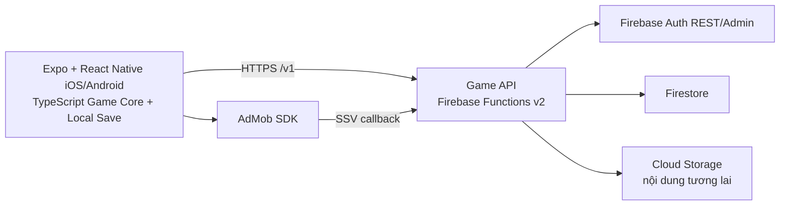

# Kiến trúc hệ thống — Kiếm Khai Tiên Lộ

## Sơ đồ

**Quy tắc sở hữu dữ liệu:** React Native xử lý từng nước đi và lưu tiến trình offline. Game API sở hữu phiên đăng nhập, đồng bộ, cấu hình và sổ quảng cáo. App không kết nối trực tiếp tới Firestore hoặc Storage; rules của hai dịch vụ từ chối mobile/web client. Admin SDK trên Functions truy cập bằng IAM.

## Client

| Thành phần | Trách nhiệm |
| --- | --- |
| TypeScript `BoardEngine`, `LevelCatalog` | Luật ghép, combo, Kiếm Trảm, kiếm khí, mục tiêu, boss; 3 màn thử nghiệm đóng gói |
| Expo Router + React Native views | Bản đồ, màn chơi, tu vi, account; lưới 7×7 tĩnh bằng ảnh WebP và điều khiển vuốt/chọn ô |
| AsyncStorage | Sao cao nhất, màn đang chơi, snapshot bàn cờ; JSON có version và bản dự phòng |
| API client (`fetch`) | Gọi HTTPS, tự tạo tài khoản khách khi có mạng, làm mới token và đồng bộ định kỳ |
| Expo SecureStore | Lưu phiên trong Keychain/Keystore trên thiết bị |
| `react-native-google-mobile-ads` | Rewarded AdMob, chỉ bật khi có mạng, server cho phép và SDK đã cấu hình |
| Skia + Reanimated + Worklets | Đã cài cho giai đoạn animation sau; phiên bản migration hiện chưa dùng để render hoặc animate gameplay |

Lượt chơi không cần mạng. Asset cho 3 màn thử nghiệm nằm trong bản build. `GET /bootstrap` trả `levelCount: 3` và có thể thay đổi cờ quảng cáo; bản đóng gói vẫn là nguồn dự phòng offline. Expo Prebuild sinh native project từ cấu hình và plugin, còn client dùng development build để kiểm tra thư viện native.

## Game API

| Endpoint | Auth | Dữ liệu chính |
| --- | --- | --- |
| `POST /v1/auth/guest` | Không | Tạo tài khoản khách và phiên Firebase Auth |
| `POST /v1/auth/register` | Khách hoặc không | Email/mật khẩu; liên kết UID khách nếu có bearer token |
| `POST /v1/auth/login` | Không; có thể kèm bearer khách | Đăng nhập và gộp tiến trình khách đã đồng bộ vào tài khoản |
| `POST /v1/auth/refresh` | Refresh token | Cấp ID/refresh token mới qua backend |
| `GET /v1/bootstrap` | Không | `contentVersion`, `levelCount`, `rewardedAdsEnabled`, `minClientVersion` |
| `GET /v1/progress` | Có | Danh sách `{levelId, stars}`, màn mở khóa, tu vi |
| `PUT /v1/progress` | Có | Gộp `levels[]` theo số sao cao nhất, không chấp nhận màn bị nhảy cóc |
| `POST /v1/ads/intents` | Có | Tạo intent `extra_moves` cho màn đã mở |
| `GET /v1/ads/intents/{id}` | Có | Xem trạng thái intent của người chơi |
| `GET /v1/ads/admob-ssv` | Chữ ký AdMob | Xác thực callback ECDSA, ad unit, vật phẩm và giao dịch duy nhất |

API viết TypeScript/Node.js, chạy trong một HTTP Function ở `asia-southeast1`. Firebase Auth quản lý mật khẩu; API là cổng duy nhất mà app gọi. Mật khẩu không được ghi vào Firestore hay log. ID token được Admin SDK xác thực trước mọi truy cập hồ sơ.

### Firestore

- `players/{uid}`: `stars` theo màn, `highestUnlocked`, `realm`, `updatedAt`; tu vi tính lại từ chuỗi màn đã hoàn thành.
- `gameConfig/current`: cờ bật quảng cáo và phiên bản client tối thiểu. Mặc định quảng cáo tắt khi document chưa tồn tại.
- `adIntents/{intentId}`: chủ intent, màn, trạng thái `pending/verified`, hạn dùng.
- `adTransactions/{transactionId}`: khóa chống cộng thưởng hai lần khi AdMob gửi callback lặp.
- `authThrottle/{hash}`: giới hạn số lần gọi đăng nhập/đăng ký theo cửa sổ thời gian; không lưu email hoặc IP dạng thô.

`authThrottle.expiresAt` và `adIntents.ttlAt` là trường dành cho Firestore TTL. Cloud Storage chưa nằm trong luồng chơi bản đầu; nếu có gói nội dung từ Storage về sau, backend sẽ đọc và phục vụ qua API, không cấp URL truy cập Storage trực tiếp cho client.

## Luồng dữ liệu và lỗi

1. **Offline lần đầu:** client tạo save cục bộ. Khi có mạng, `/auth/guest` cấp phiên và `/progress` nhận các màn đã thắng.
2. **Đăng ký:** tài khoản khách được liên kết email/mật khẩu trên cùng UID. Nếu đăng nhập tài khoản đã tồn tại, server gộp profile khách và profile đích bằng giao dịch Firestore; client gửi thêm kết quả cục bộ sau đó.
3. **Đồng bộ:** `PUT /progress` nhận toàn bộ kết quả màn và trả kết quả đã gộp. Phép gộp lấy `max(stars)` nên gửi lại cùng dữ liệu không làm giảm tiến trình. Client thử lại khi mạng trở lại.
4. **Thưởng quảng cáo:** API tạo intent trước khi hiển thị. Client nhận thêm ba lượt khi SDK báo hoàn thành; callback SSV được xác thực và ghi giao dịch duy nhất. Quảng cáo không hiển thị khi offline hoặc khi cờ server tắt.
5. **Lỗi:** game tiếp tục dùng save cục bộ khi API không sẵn sàng. Token hết hạn được làm mới qua API; đăng nhập lại nếu refresh token không còn hợp lệ. Callback SSV trùng trả thành công nhưng không ghi thưởng thêm.

Đây là game chơi đơn không có xếp hạng hoặc kinh tế cạnh tranh: server xác nhận cấu trúc và thứ tự tiến trình, không chạy lại từng nước ghép. Việc không xác minh email và không có khôi phục mật khẩu là lựa chọn của bản đầu; người quên mật khẩu sau khi mất phiên không thể tự khôi phục tài khoản.
